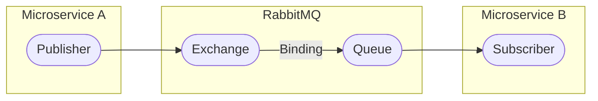

# RabbitMQ Workshop

```mermaid
flowchart LR
    subgraph Microservice A
        publisher(["Publisher"])
    end
    subgraph RabbitMQ
        exchange(["Exchange"])
        queue(["Queue"])
    end
    subgraph Microservice B
        subscriber(["Subscriber"])
    end
    publisher --> exchange -->|Binding| queue --> subscriber
```
