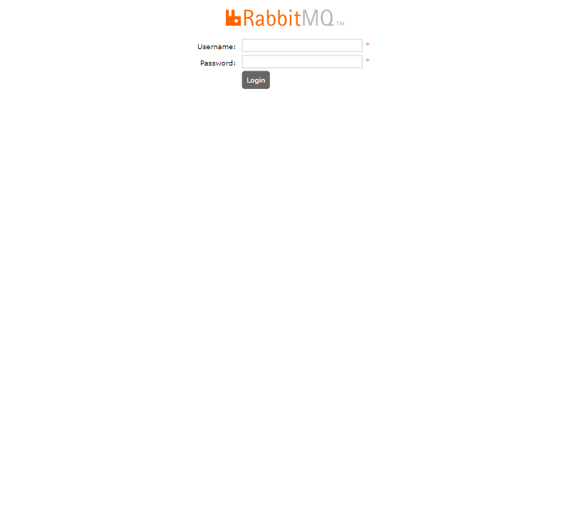
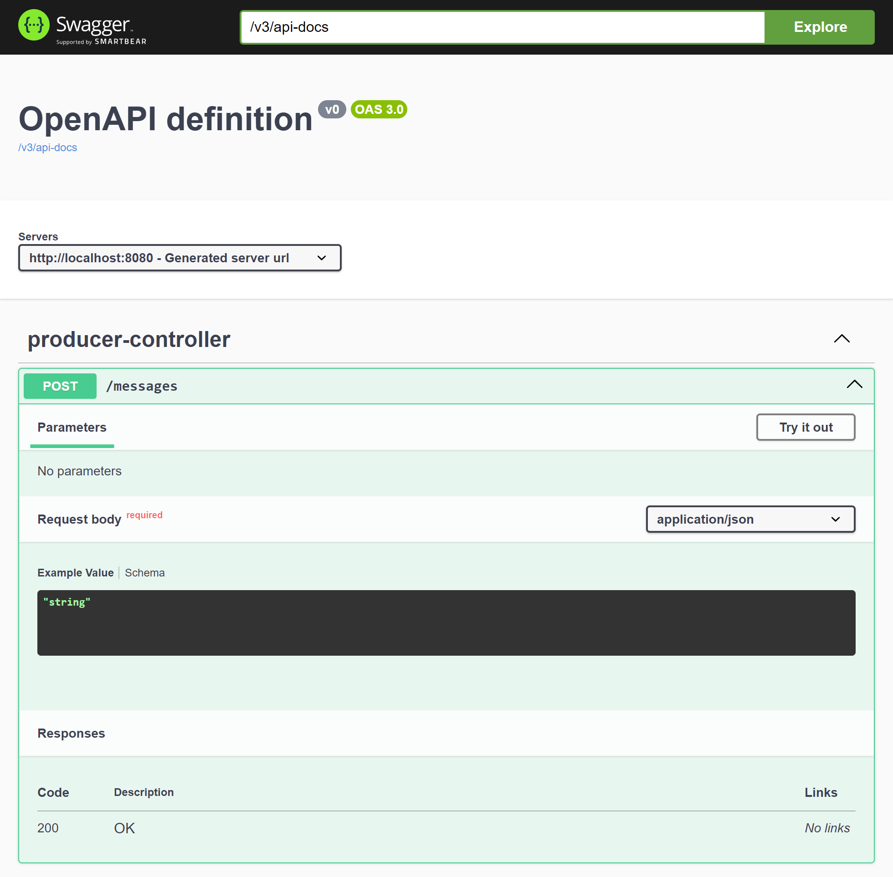
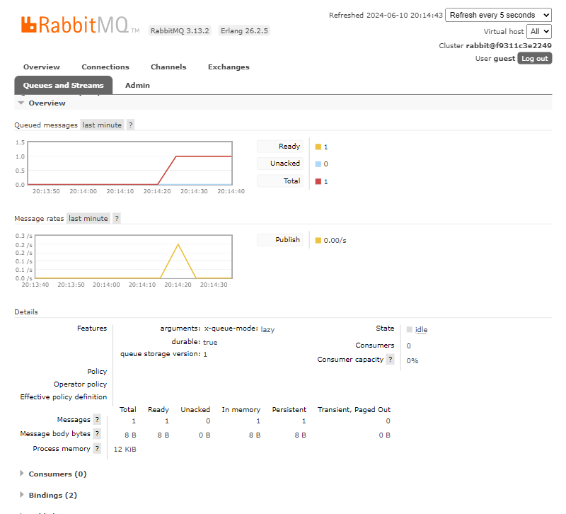
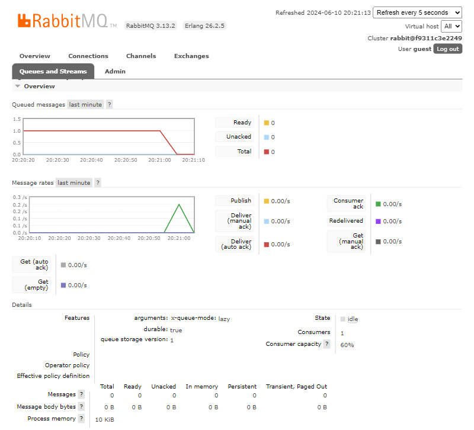

# RabbitMQ Workshop

RabbitMQ is an open source messaging broker.

https://tryrabbitmq.com/

## Dependencies

- [Spring Boot Starter AMQP](https://mvnrepository.com/artifact/org.springframework.boot/spring-boot-starter-amqp)

## Architecture


## Commands

Run Spring Boot: ProducerApplication in IntelliJ.

List running Docker containers:

```shell
docker container ps
```

Notice `rabbitmq-workshop-rabbitmq-1` is listed.

Open RabbitMQ Management Interface in your browser:

```
http://localhost:15672
```


Default username and password are guest.

Go to the Queues and Streams tab. Notice there are no queues.

Open Swagger UI in your browser:

```
http://localhost:8080/swagger-ui/index.html
```



Produce a message.



Run Spring Boot: ConsumerApplication in IntelliJ.



The message has been consumed.

Prune Docker volume:

```shell
docker rm -vf $(docker ps -aq)
```