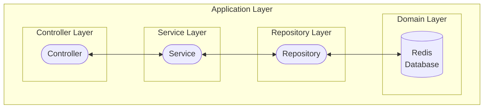
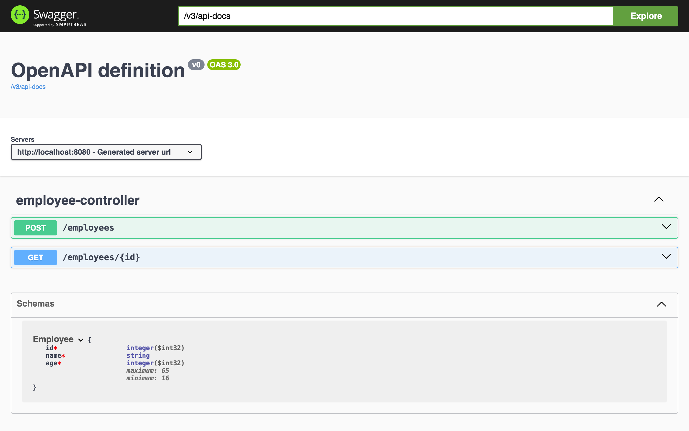

# Redis Workshop

Redis is an in-memory key-value non-relational database. It can also be used for caching.

## Dependencies

- Spring Data Redis (to use as a database)
- Spring Cache Abstraction (to use as a cache)

## Architecture



([repository module](https://github.com/crigraiba/learning/tree/main/redis-workshop/repository))

Or skip the Repository Layer with Redis Template ([template module](https://github.com/crigraiba/learning/tree/main/redis-workshop/template)).

## Commands

### As a database

Run Spring Boot: EmployeeApplication in IntelliJ.

List running Docker containers:

```shell
docker container ps
```

Notice `redis-workshop-database-1` is listed.

Open Swagger UI in your browser:

```text
http://localhost:8080/swagger-ui/index.html
```



:woman_scientist: **Try it out!**

Open Redis CLI in your terminal:

```shell
docker exec -it redis-workshop-database-1 redis-cli
```

<table>
<tr>
<td><pre>monitor</pre></td>
<td>Open the monitoring mode. Commands that are executed will be printed.</td>
</tr>
<tr>
<td><pre>set my_key my_value</pre></td>
<td>
Set key-value pair. Optional:
<ul>
<li><code>xx</code> – to overwrite the value if the key already exists.</li>
<li><code>nx</code> – to set it if the key does not exist yet.</li>
<li><code>ex 60</code> – to set an expiration time in seconds.</li>
<li><code>keepttl</code> – to not reset the expiration time when overwriting a value.</li>
</ul>
</td>
</tr>
<tr>
<td>
<pre>hset my_key my_field1 my_value1
my_field2 my_value2 ...</pre>
</td>
<td>Set key-(field-value pairs) pair. Used for storing complex data, such as objects.</td>
</tr>
<tr>
<td><pre>get my_key</pre></td>
<td>Get value by its key.</td>
</tr>
<tr>
<td><pre>hgetall my_key</pre></td>
<td>Get fields and values by their key.</td>
</tr>
<tr>
<td><pre>expire my_key 60</pre></td>
<td>Set expiration time of key in seconds.</td>
</tr>
<tr>
<td><pre>ttl my_key</pre></td>
<td>Get amount of time left in seconds for a key to expire. Stands for <i>time to live</i>.</td>
</tr>
<tr>
<td><pre>keys pattern</pre></td>
<td>List keys matching pattern.</td>
</tr>
<tr>
<td><pre>del my_key</pre></td>
<td>Delete key.</td>
</tr>
<tr>
<td><pre>quit</pre></td>
<td>Exit.</td>
</tr>
</table>

### As a cache

Configuration:

<table>
<tr>
<td><pre>application.yml</pre></td>
<td>
<pre>
spring:
  cache:
    type: redis
</pre>
</td>
</tr>
<tr>
<td><pre>EmployeeApplication</pre></td>
<td><pre>@EnableCaching</pre></td>
</tr>
<tr>
<td><pre>EmployeeService#findById</pre></td>
<td><pre>@Cacheable("Employee)</pre></td>
</tr>
<tr>
<td><pre>Employee</pre></td>
<td><pre> : Serializable</pre></td>
</tr>
</table>