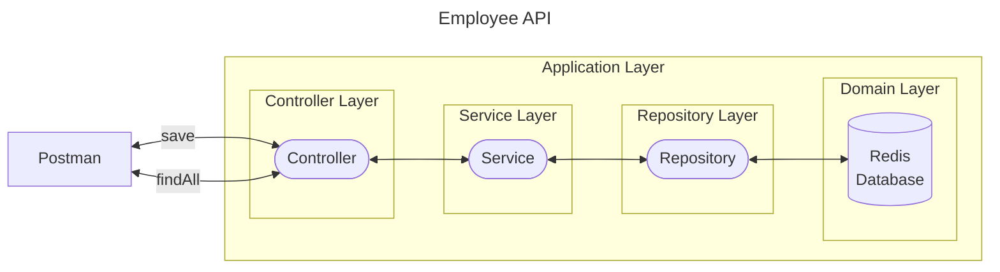

# Redis Workshop


```mermaid
---
title: Employee API
---
flowchart LR
    subgraph Application Layer
        subgraph Controller Layer
            controller(["Controller"])
        end
        subgraph Service Layer
            service(["Service"])
        end
        subgraph Repository Layer
            repository(["Repository"])
        end
        subgraph Domain Layer
            domain[("`Redis
            Database`")]
        end
    end
    postman["Postman"] <-->|save| controller
    postman["Postman"] <-->|findAll| controller
    controller <--> service <--> repository <--> domain
```

```shell
docker-compose up -d
```

```shell
docker exec -it redis-workshop-database-1 redis-cli
```

### Redis

```redis
MONITOR
```

```redis
QUIT
```